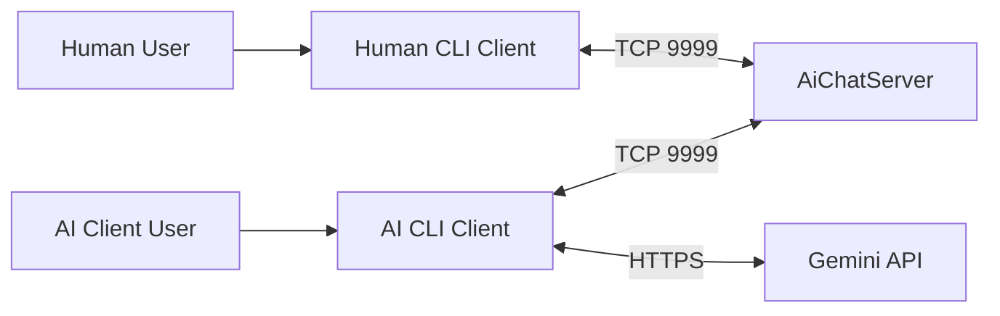
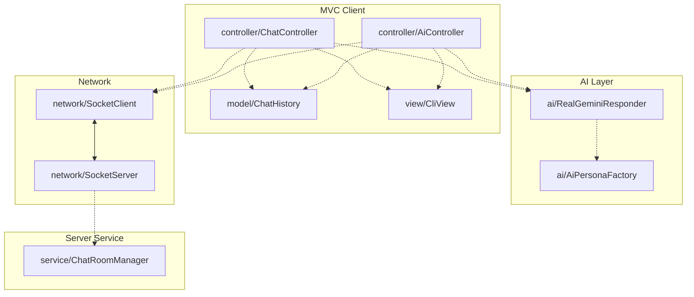
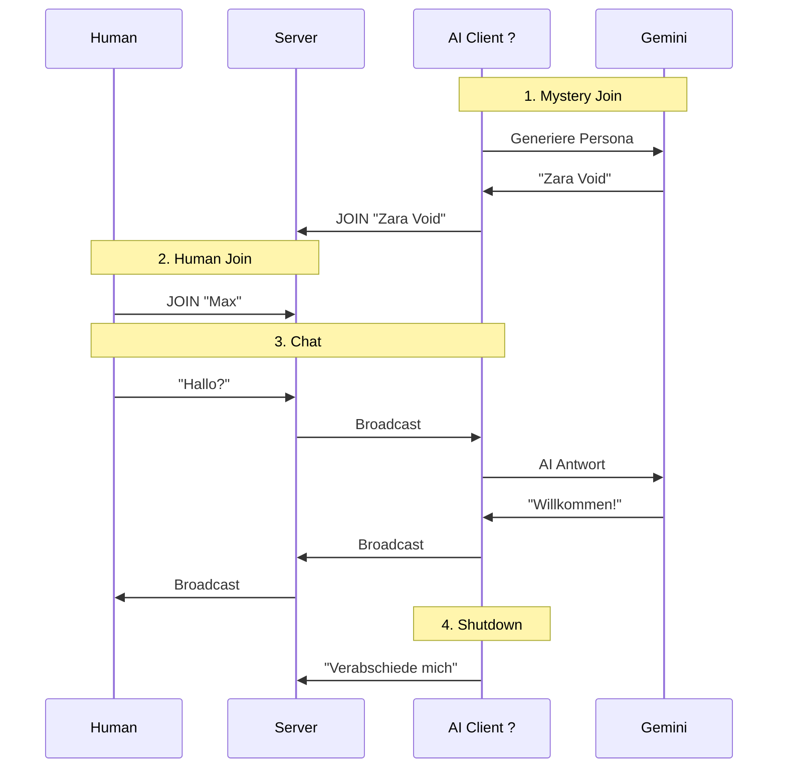
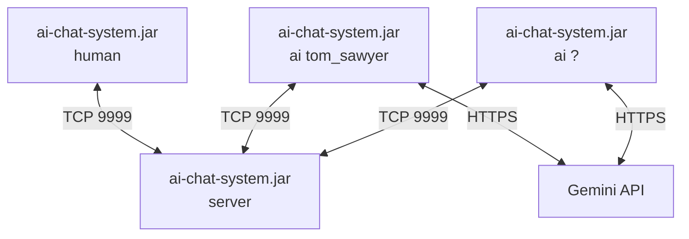

# arc42 Dokumentation: AI Chat System
**Version:** 1.0  
**Datum:** 27.04.2026  
**Autor:** larlibu  
**Technologie:** Java 21, Maven, MVC, stdlib, Gemini API

## 1. Einführung & Ziele

### 1.1 Aufgabenstellung
Das System ist ein Single-Room-Chat mit einem zentralen Server und mehreren Clients. Neben menschlichen Clients gibt es AI-Clients mit auswählbaren Personas und einem dynamisch generierten Mystery-Guest-Modus ("?").

### 1.2 Qualitätsziele
| Ziel | Priorität | Beschreibung |
|------|-----------|--------------|
| Wartbarkeit | Hoch | Klare Trennung von Model, View und Controller |
| Erweiterbarkeit | Hoch | Neue Personas und neue Client-Typen sollen leicht ergänzbar sein |
| Nachvollziehbarkeit | Hoch | Architektur soll in arc42 sauber dokumentiert sein |
| Laufzeitstabilität | Mittel | Soft Shutdown und robuste Socket-Kommunikation |

### 1.3 Stakeholder
- Entwickler und Architekten
- Tester
- Nutzer des Chat-Systems
- KI-Provider über Gemini API

## 2. Randbedingungen

### 2.1 Technische Randbedingungen
- Java 21
- Maven Einmodul-Projekt
- Keine Frameworks wie Spring Boot
- Nutzung von `java.net.Socket`, `java.net.ServerSocket`, `java.net.http.HttpClient`
- CLI-basierter Start

### 2.2 Fachliche Randbedingungen
- Single-Room-Chat
- AI-Personas: Tom Sawyer, Albert Zweistein, Mystery Guest
- Soft Shutdown für AI-Clients
- Echte AI statt Template-Simulation

## 3. Kontextabgrenzung



### 3.1 Fachlicher Kontext
Der Server verwaltet den globalen Chatraum. Human- und AI-Clients senden Nachrichten an denselben Raum. AI-Clients rufen zusätzlich die Gemini API auf, um Antworten oder dynamische Personas zu generieren.

## 4. Lösungskonzept

### 4.1 Architekturprinzipien
- MVC für klare Trennung der Verantwortlichkeiten
- Interfaces für Entkopplung und Testbarkeit
- Constructor Injection statt Framework-DI
- Einmodul-Maven für einfache Build- und Startlogik

### 4.2 Wichtige Bausteine
- `model`: ChatMessage, ChatHistory, Persona
- `view`: CliView
- `controller`: ChatController, AiController
- `network`: SocketServer, SocketClient
- `ai`: AIResponder, RealGeminiResponder, AiPersonaFactory
- `service`: ChatRoomManager
- `factory`: AppFactory

## 5. Bausteinsicht



### 5.1 Paketstruktur
```text
src/main/java/de/larlibu/aichat/
├── AiChatMain.java
├── model/
├── view/
├── controller/
├── network/
├── ai/
├── service/
└── factory/
```

## 6. Laufzeitsicht



### 6.1 Szenario
Ein AI-Client wird mit der Option "?" gestartet. Er erzeugt über Gemini eine neue Persona, tritt dem Chat bei, antwortet auf Nachrichten und beendet sich anschließend über Soft Shutdown.

## 7. Verteilungssicht



### 7.1 Deployment
Alle Rollen laufen als Prozesse auf derselben Maschine oder verteilt auf mehreren Maschinen. Der Server stellt den Chatraum bereit, die Clients verbinden sich per TCP, und AI-Clients sprechen zusätzlich mit Gemini.

## 8. Querschnittliche Konzepte

### 8.1 MVC und Interfaces
Die Abhängigkeiten laufen über Interfaces, damit Controller nicht an konkrete Implementierungen gebunden sind. Das erleichtert Tests und spätere Anpassungen.

### 8.2 Dependency Injection
Statt Spring Boot wird Constructor Injection verwendet. Die Objekte werden in einer Factory erzeugt und zusammengesetzt.

### 8.3 Fehlerbehandlung
- Socket-Verbindungen werden geprüft
- Gemini-Aufrufe erhalten Timeouts
- AI-Fallbacks werden bei Fehlern definiert

### 8.4 Konfiguration
Konfiguration erfolgt über `Properties`, zum Beispiel für API-Key und Persona-Prompts.

## 9. Architekturelle Entscheidungen

| ID | Entscheidung | Begründung |
|----|--------------|------------|
| D1 | Einmodul-Maven | Einfacher Build und weniger Komplexität |
| D2 | MVC | Klare Trennung von Verantwortung |
| D3 | Interfaces | Testbarkeit und Austauschbarkeit |
| D4 | Constructor Injection | Explizite und nachvollziehbare Abhängigkeiten |
| D5 | HttpClient für Gemini | Echte AI ohne Frameworks |
| D6 | Soft Shutdown | Sauberes Beenden von AI-Clients |

## 10. Qualitätsanforderungen

### 10.1 Qualitätsziele
- schnelle Chat-Reaktion
- robuste Netzwerkkommunikation
- wartbare Struktur
- einfach erweiterbare Personas

### 10.2 Qualitätsszenarien
- Ein AI-Client soll sich mit einer neu generierten Persona anmelden können.
- Ein Human-Client soll Nachrichten senden und empfangen können.
- Der Server soll Broadcasts an alle Clients verteilen.
- AI-Clients sollen sich vor dem Beenden höflich verabschieden.

## 11. Risiken und technische Schulden

| Risiko | Auswirkung | Maßnahme |
|--------|------------|----------|
| Gemini nicht erreichbar | AI-Client kann nicht antworten | Fallback-Nachricht oder Retry |
| Socket-Verbindung bricht ab | Chat-Teilnehmer verliert Verbindung | Reconnect-Logik |
| JSON-Parsing fehlerhaft | AI-Antwort nicht lesbar | Robuste Fehlerbehandlung |

## 12. Glossar

- **Single-Room-Chat:** Ein globaler Chatraum für alle Teilnehmer.
- **Persona:** Charakterbeschreibung und Sprechweise einer AI.
- **Mystery Guest:** Dynamisch generierte, neue AI-Persona.
- **Soft Shutdown:** Beenden mit Abschiedsnachricht statt abruptem Disconnect.